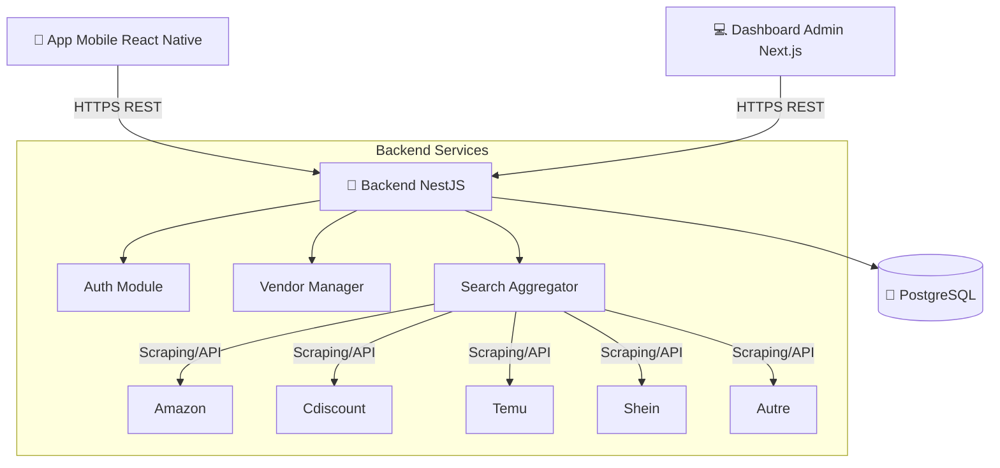

# Architecture & Conception Technique - Comparateur MVP

## 1. Architecture Globale

L'architecture est composée de 3 briques principales communiquant via une API REST centralisée.

### Choix Techniques
*   **Backend**: NestJS pour sa structure modulaire et son injection de dépendances, idéales pour gérer les multiples stratégies de fournisseurs (Vendors).
*   **Persistance**: PostgreSQL avec **Prisma** (ou TypeORM). Prisma est choisi ici pour sa simplicité de typage et sa rapidité de mise en place ("Database First" ou "Schema First").
*   **Mobile**: React Native + Expo pour une itération rapide sur iOS/Android.
*   **Web Admin**: Next.js pour le SSR et la facilité de création de dashboards.

---

## 2. Modèles de Données (Entités Principales)

### `Vendor` (Marchand)
Gère la configuration des sources de données.
*   `id`: UUID
*   `name`: String (ex: "Amazon")
*   `slug`: String (ex: "amazon")
*   `baseUrl`: String
*   `isActive`: Boolean (Status pour le switch ON/OFF)
*   `apiConfig`: JSON (Clés d'API, sélecteurs CSS spécifiques si scraping)

### `ReferenceProduct` (Cache - Optionnel MVP)
Pour éviter de requêter les marchands à chaque fois, on peut cacher les résultats populaires temporairement.
*   `id`: UUID
*   `searchQuery`: String (Indexé)
*   `data`: JSON (Résultat agrégé normalisé)
*   `createdAt`: Timestamp (TTL)

### `User` & `Favorite`
*   `User`: { `id`, `deviceId`, `email` (opt) }
*   `Favorite`: 
    *   `id`: UUID
    *   `userId`: FK -> User
    *   `productTitle`: String
    *   `minPrice`: Float
    *   `imageUrl`: String
    *   `externalLinks`: JSON (Liste des URL marchands pour ce favori)

---

## 3. Endpoints API

### Search Module
*   `GET /search?q=iphone+15`
    *   **Response**: `ProductResult[]`
    *   **Logique**: Lance l'agrégateur sur tous les `Vendor` où `isActive = true`.

### Vendor Module (Admin)
*   `GET /vendors` -> Liste des marchands + stats (réussites/échecs).
*   `PATCH /vendors/:id` -> Body: `{ isActive: boolean }`.
*   `POST /vendors` -> Ajouter un nouveau marchand.

### Favorites Module
*   `GET /favorites`
*   `POST /favorites` -> Body: `{ productTitle, minPrice, imageUrl, links: [...] }`
*   `DELETE /favorites/:id`

---

## 4. Stratégie d'Agrégation (Pattern Strategy)

Le cœur du système est le `SearchService` qui itère sur une liste de `IVendorStrategy`.
Chaque marchand (Amazon, Cdiscount...) a sa propre classe implémentant `search(query: string): Promise<SearchResult[]>`.
Le service combine les résultats, normalise les prix, et trie par prix croissant.
